# Biohazard

In this write up i will show case how to solve the challenge **Biohazard from tryhckme**

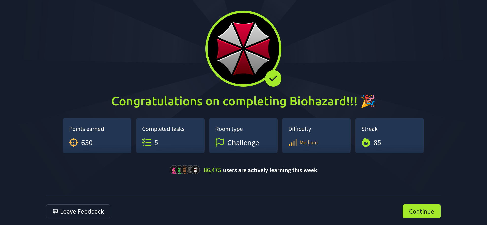

### Nmap Port scanning

Command: 

```powershell
sudo nmap -Pn -n -T4 -p- -sV -sC -sS 10.64.182.135 -oN nmap_scan
```

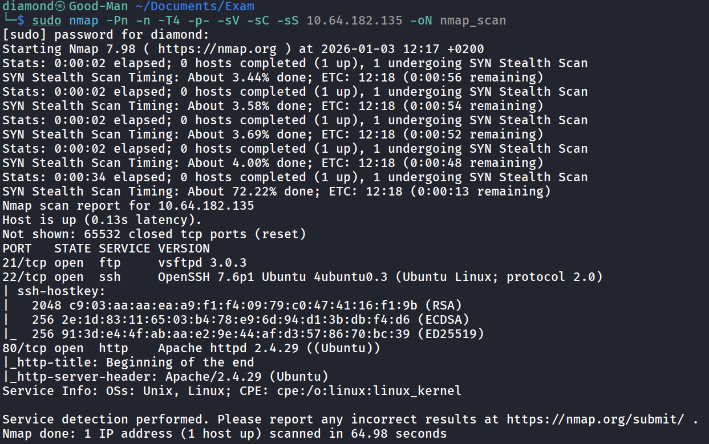

**Question 1: How many open ports? 3**

### FTP 21

Not accepting anonymous login and the version has no known exploits can be useful 

### HTTP 80

Main page is:**What is the team name in operation? STARS alpha team**

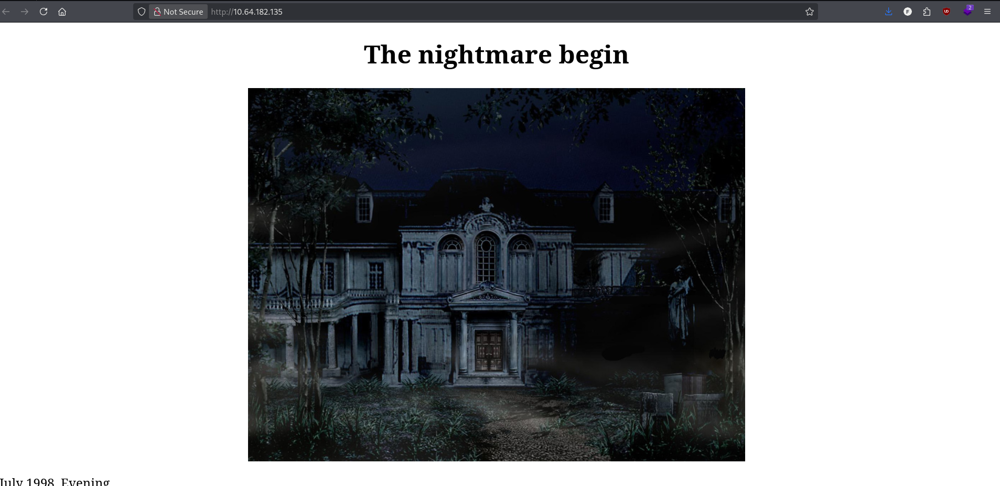

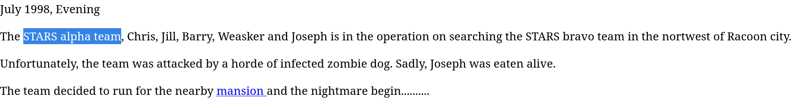

**What is the team name in operation? STARS alpha team**

Click the mansion link and visit it check the source code you will see a hidden directory

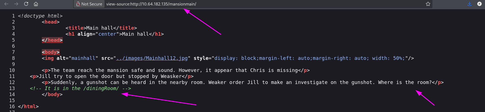

**You will see a page called emblem.php visit it to reveal the emblem flag**

**emblem{fec832623ea498e20bf4fe1821d58727}** 


**Visiting it the diningRoom/ back and checking the source code revealed a base 64 encoded** 

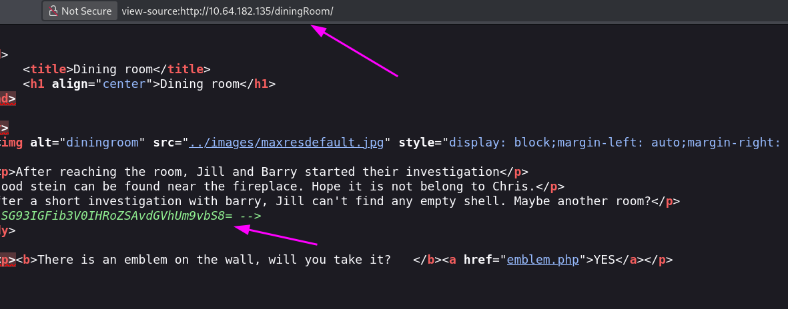

**Lets decode it and see what is it**

Another directory > How about the /teaRoom/ 

Lets visit it 

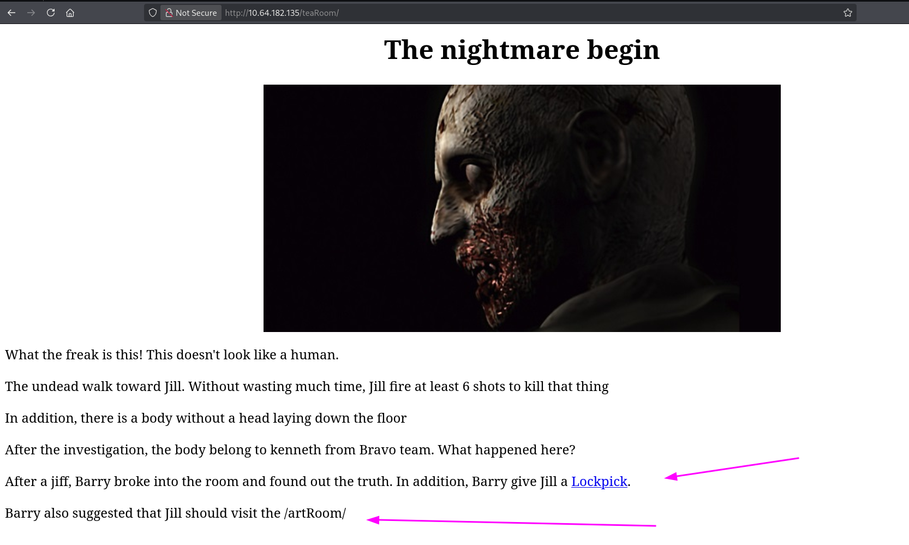

**Visiting the link revealed the flag: lock_pick{037b35e2ff90916a9abf99129c8e1837}**

**Lets now visit the directory mentioned:** [http://10.64.182.135/artRoom/](http://10.64.182.135//artRoom/)

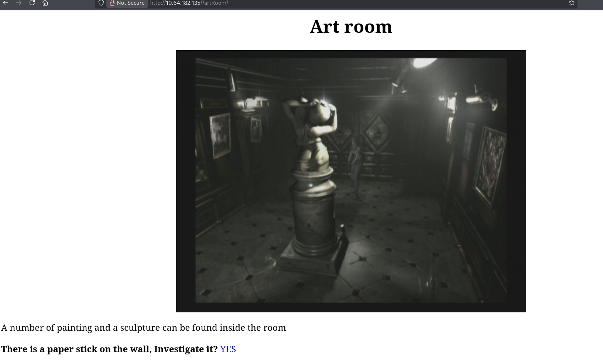

**Clicking on YES reveals an endpoint** [http://10.64.182.135//artRoom/MansionMap.html](http://10.64.182.135//artRoom/MansionMap.html)

**It contains amp maybe for the challenge**

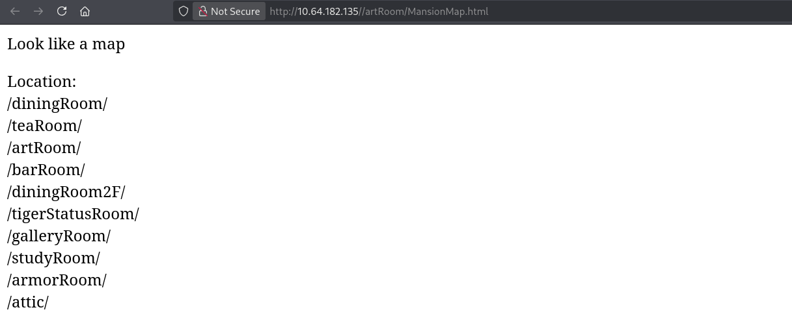

```powershell
Location:

/diningRoom/

/teaRoom/

/artRoom/

/barRoom/

/diningRoom2F/

/tigerStatusRoom/

/galleryRoom/

/studyRoom/

/armorRoom/

/attic/
```

We already visited until the /barRoom/ so lets visit this 

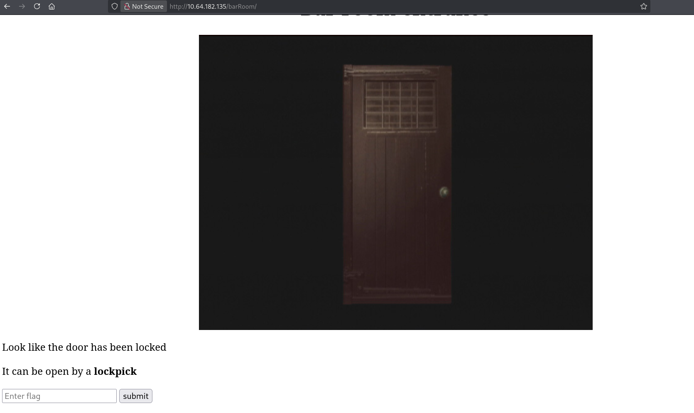

Lets enter the lockpick flag to see what happens

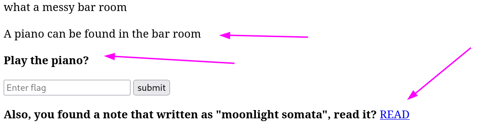

**Visiting the embeded link revealed an encoded note lets encode it** 

**music_sheet{362d72deaf65f5bdc63daece6a1f676e}**

**Lets enter it in the page and it revealed a secret room** 

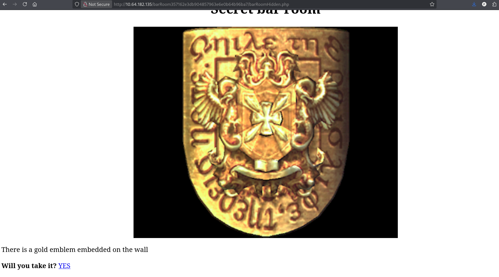

**Click on yes it will reveal a flag and note**

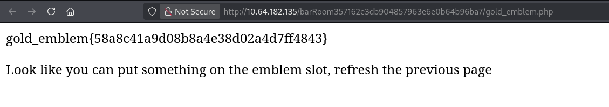

**gold_emblem{58a8c41a9d08b8a4e38d02a4d7ff4843}**

**Lets refresh the secret room And put the emblem flag we found first flag we found**

We got a user called **rebecca**

**Now whats next ? after further enumeration i visited back the the diningRoom/ and i said what will happen if i put the goldemblem flag we found there**

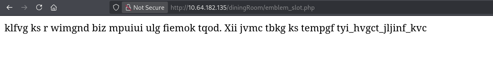

Now the fun comes i think this is a cypher text and can be decrypted by the name found **rebecca**

Lets try

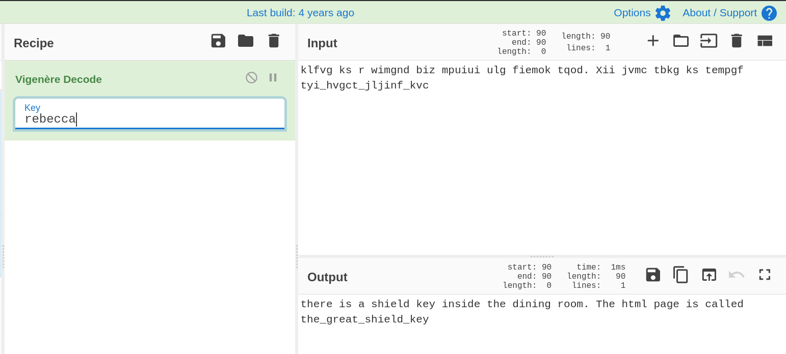

It worked!!
**there is a shield key inside the dining room. The html page is called the_great_shield_key**

Lets visit the page [http://10.64.182.135/diningRoom/the_great_shield_key.html](http://10.64.182.135/diningRoom/the_great_shield_key.html)

**shield_key{48a7a9227cd7eb89f0a062590798cbac}**

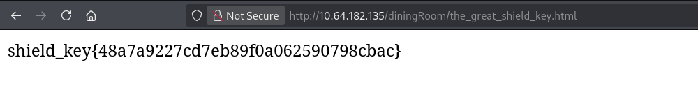

**Now lets go back to the map and visit the endpoint called  /diningRoom2F/**

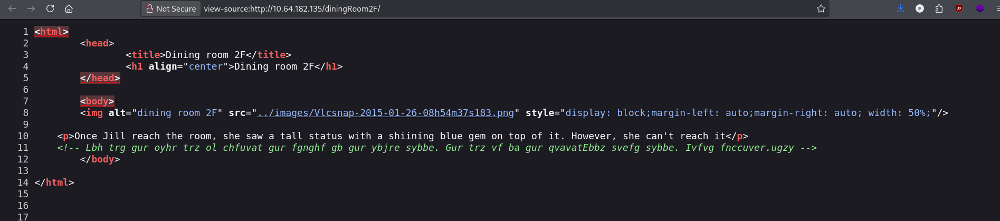

Lets find what this cypher again

**Its rot 13 encrypted**

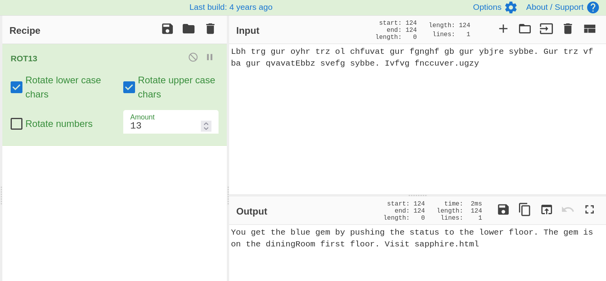

**You get the blue gem by pushing the status to the lower floor. The gem is on the diningRoom first floor. Visit sapphire.html**

So lets visit this site [http://10.64.182.135/diningRoom/sapphire.html](http://10.64.182.135/diningRoom/sapphire.html)

It revealed another flag!

**blue_jewel{e1d457e96cac640f863ec7bc475d48aa}**

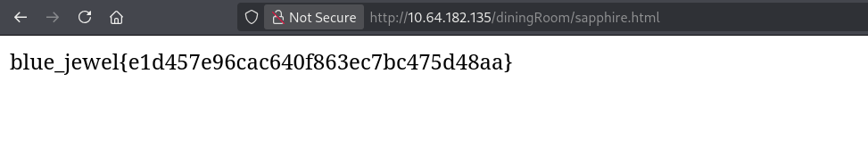

**Now again lets check the map**

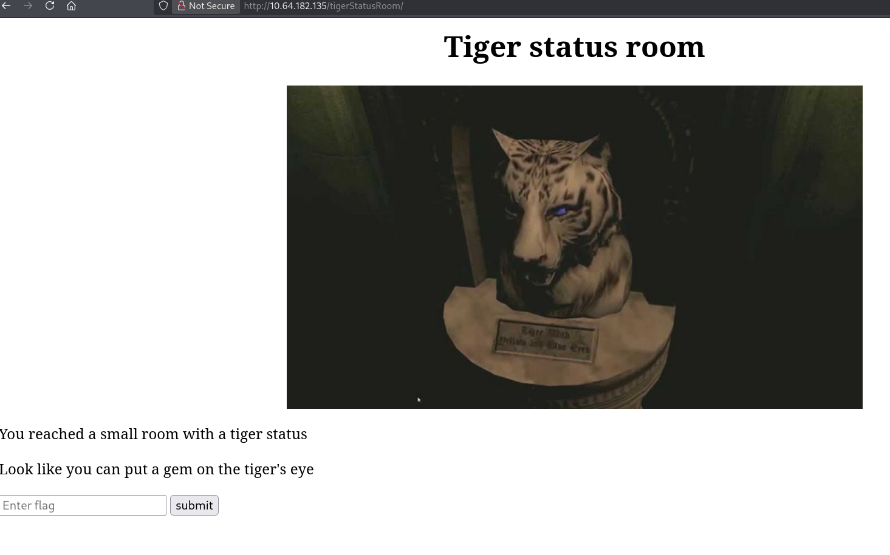

put the jewel flag we found


```powershell
crest 1:
S0pXRkVVS0pKQkxIVVdTWUpFM0VTUlk9
Hint 1: Crest 1  has been encoded twice
Hint 2: Crest 1 contanis 14 letters
Note: You need to collect all 4 crests, combine and decode to reavel another path
The
 combination should be crest 1 + crest 2 + crest 3 + crest 4. Also, the 
combination is a type of encoded base and you need to decode it
```

**Interesting!!!**

**After some tries i tried to not it and continue with the map** 

Lets vistit the  /galleryRoom/ 

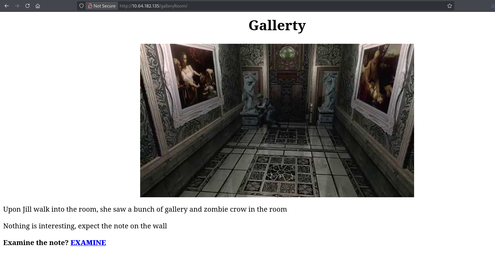

**Click the link to find the crest 2**

```powershell
crest 2:
GVFWK5KHK5WTGTCILE4DKY3DNN4GQQRTM5AVCTKE
Hint 1: Crest 2 has been encoded twice
Hint 2: Crest 2 contanis 18 letters
Note: You need to collect all 4 crests, combine and decode to reavel another path
The combination should be crest 1 + crest 2 + crest 3 + crest 4. Also, the combination is a type of encoded base and you need to decode it
```

**Visting /studyRoom/** 

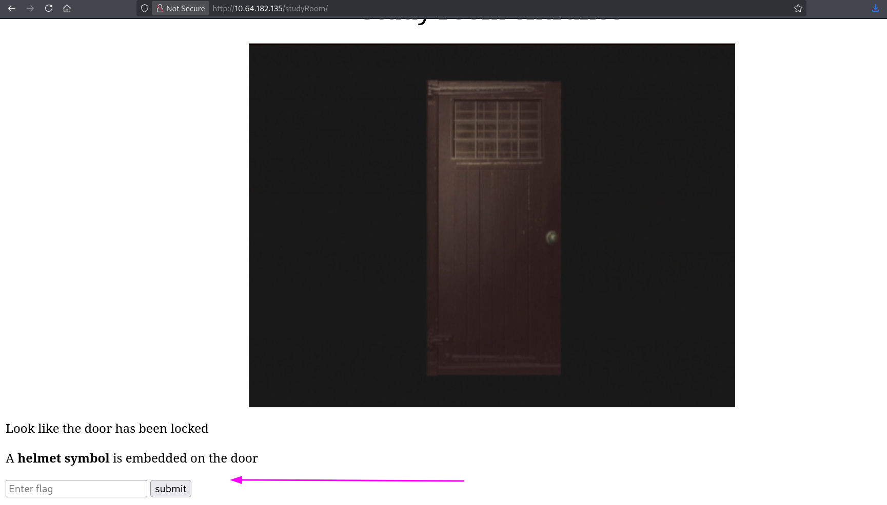

enter the shield flag 

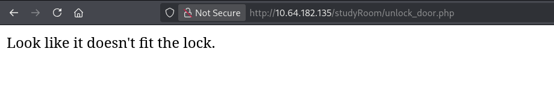

Nothing can do here for now lets visit the others

Visit the /armorRoom/ and enter the shield flag

```powershell
crest 3:
MDAxMTAxMTAgMDAxMTAwMTEgMDAxMDAwMDAgMDAxMTAwMTEgMDAxMTAwMTEgMDAxMDAwMDAgMDAxMTAxMDAgMDExMDAxMDAgMDAxMDAwMDAgMDAxMTAwMTEgMDAxMTAxMTAgMDAxMDAwMDAgMDAxMTAxMDAgMDAxMTEwMDEgMDAxMDAwMDAgMDAxMTAxMDAgMDAxMTEwMDAgMDAxMDAwMDAgMDAxMTAxMTAgMDExMDAwMTEgMDAxMDAwMDAgMDAxMTAxMTEgMDAxMTAxMTAgMDAxMDAwMDAgMDAxMTAxMTAgMDAxMTAxMDAgMDAxMDAwMDAgMDAxMTAxMDEgMDAxMTAxMTAgMDAxMDAwMDAgMDAxMTAwMTEgMDAxMTEwMDEgMDAxMDAwMDAgMDAxMTAxMTAgMDExMDAwMDEgMDAxMDAwMDAgMDAxMTAxMDEgMDAxMTEwMDEgMDAxMDAwMDAgMDAxMTAxMDEgMDAxMTAxMTEgMDAxMDAwMDAgMDAxMTAwMTEgMDAxMTAxMDEgMDAxMDAwMDAgMDAxMTAwMTEgMDAxMTAwMDAgMDAxMDAwMDAgMDAxMTAxMDEgMDAxMTEwMDAgMDAxMDAwMDAgMDAxMTAwMTEgMDAxMTAwMTAgMDAxMDAwMDAgMDAxMTAxMTAgMDAxMTEwMDA=
Hint 1: Crest 3 has been encoded three times
Hint 2: Crest 3 contanis 19 letters
Note: You need to collect all 4 crests, combine and decode to reavel another path
The combination should be crest 1 + crest 2 + crest 3 + crest 4. Also, the combination is a type of encoded base and you need to decode it
```

**Nice now we need the last crest 4 so lets visit the last room in the map /attic/**

**Enter the flag again**

```powershell
crest 4:
gSUERauVpvKzRpyPpuYz66JDmRTbJubaoArM6CAQsnVwte6zF9J4GGYyun3k5qM9ma4s
Hint 1: Crest 2 has been encoded twice
Hint 2: Crest 2 contanis 17 characters
Note: You need to collect all 4 crests, combine and decode to reavel another path
The combination should be crest 1 + crest 2 + crest 3 + crest 4. Also, the combination is a type of encoded base and you need to decode it
```

Now we got the 4 crests so lets decrypt it 

**After combining all 4 crests and decoding we got** 

```powershell
FTP user: hunter, FTP pass: you_cant_hide_forever
```

**Now lets login to ftp** 

**Nice its another game xD**

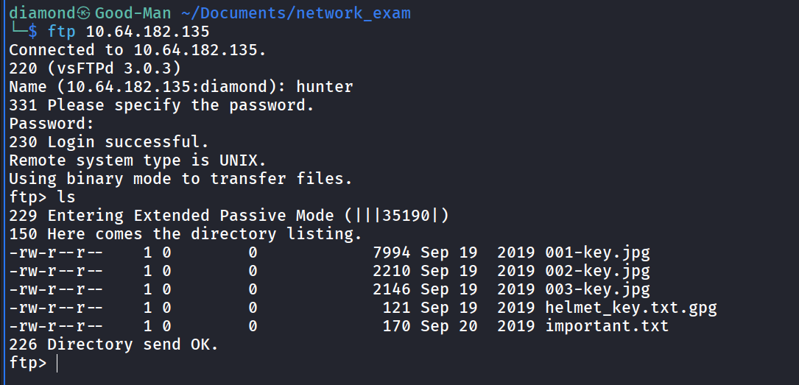

```powershell
└─$ cat important.txt 
Jill,

I think the helmet key is inside the text file, but I have no clue on decrypting stuff. Also, I come across a /hidden_closet/ door but it was locked.

From,
Barry
```

**So i think i must extract the 3 keys from the images then open the helmet_key.txt.gpg**

lets use **steghide**

Commands used:

```powershell
steghide extract -sf 001-key.jpg
cat key-001.txt

strings 002-key.jpg

binwalk -e 003-key.jpg
cd _003-key.jpg.extracted
cat key-003.txt
```

Combining 3 keys and decoding them revealed the final key 

cGxhbnQ0Ml9jYW5fYmVfZGVzdHJveV93aXRoX3Zqb2x0

**plant42_can_be_destroy_with_vjolt**

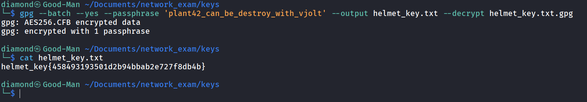

**helmet_key{458493193501d2b94bbab2e727f8db4b}**

**Now lets visit the endpoit the mentioned /hidden_closet/**

Enter the key helmet

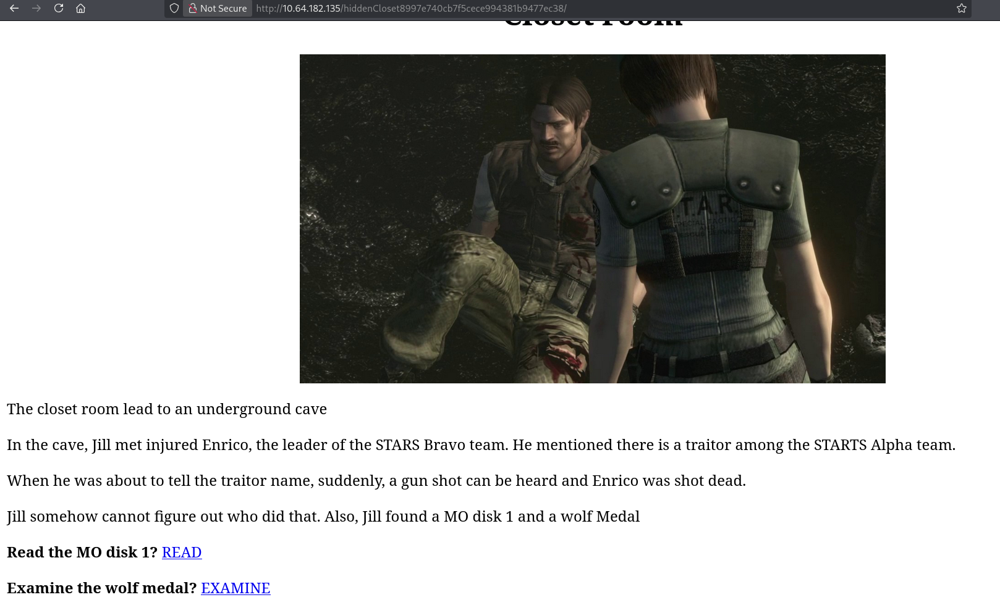

MO disk 1: `wpbwbxr wpkzg pltwnhro, txrks_xfqsxrd_bvv_fy_rvmexa_ajk` lets just note it for now and not waste time. 

STARS bravo team leader is **Enrico**

SSH PASS: **T_virus_rules**

SSH USER THE HINT SAYS WE MISSED A ROOM so lets visit the study room again and enter the helmet key flag I downloaded a **doom.tar.gz lets extract it** 

Commands:

```powershell
gunzip doom.tar.gz

tar -xvf doom.tar

cat eagle_medal.txt
```

SSH User is : **umbrella_guest**

**Now lets login to ssh**

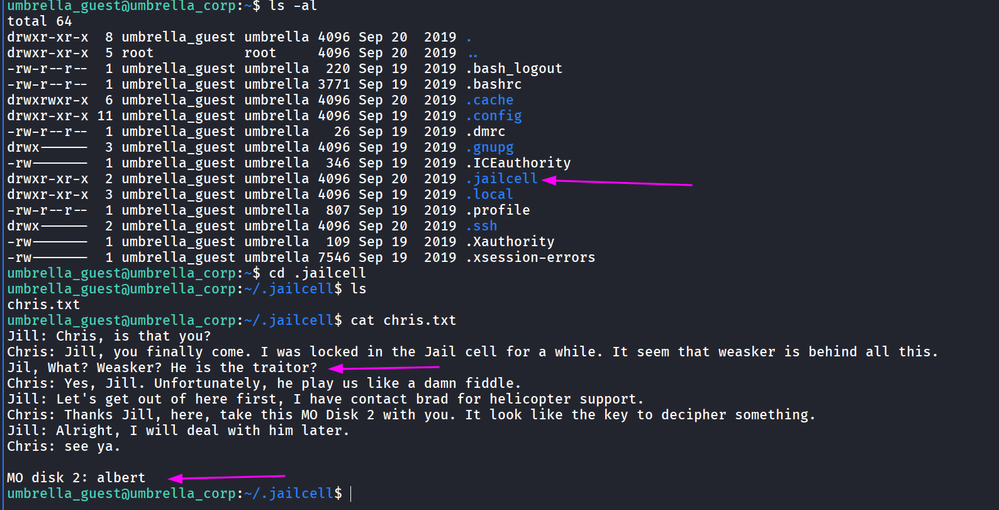

**Intersting**

Where you found Chris: **.jailcell**

Who is the traitor: **Weasker**

**The login password for the traitor: i had to check the hint and it says to decrypt the shield key .**

Now i think the key we found `wpbwbxr wpkzg pltwnhro, txrks_xfqsxrd_bvv_fy_rvmexa_ajk`

called MO disk 1 and we found MO disk 2 albert

so lets decrypt it.

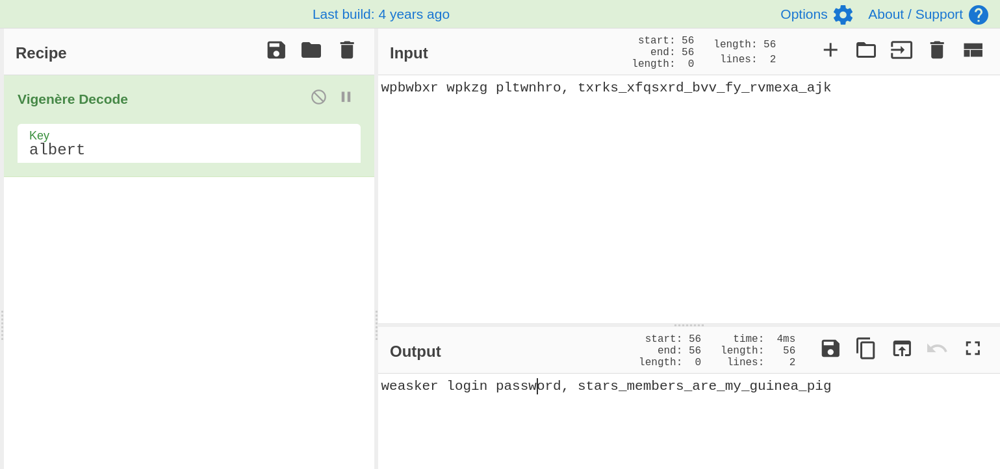

Now we have user: **Weasker** pass: **stars_members_are_my_guinea_pig**

**Lets login with these**

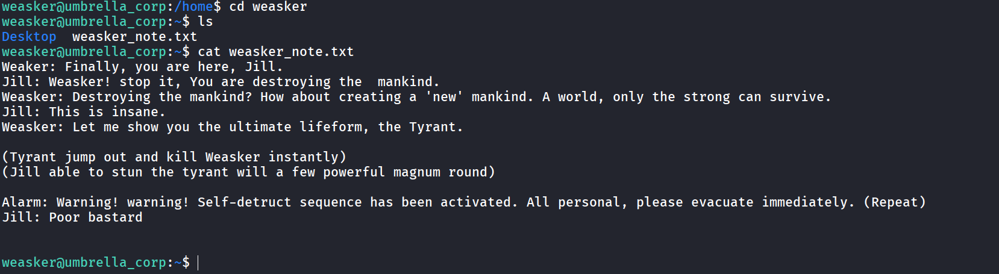

The name of the ultimate form: **Tyrant**

**Time to get the Root flag**

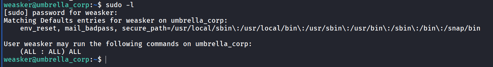

The user has the privileges to do anything in the host !!!! 

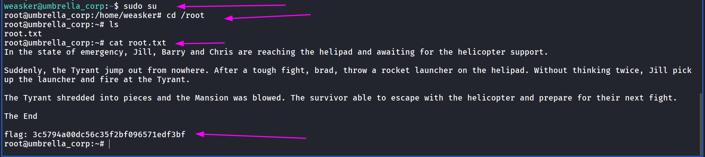

Root flag: **3c5794a00dc56c35f2bf096571edf3bf**
