# Internal

**Work Smarter not harder.**

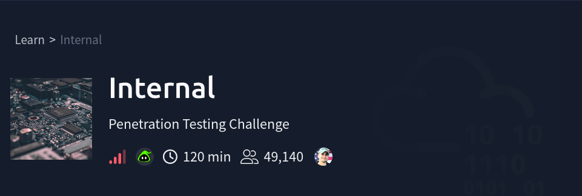

**Room: [https://tryhackme.com/room/internal](https://tryhackme.com/room/internal)**

**This Room intended to demonstrate Enumeration => Exploitation => Local Enumeration => Privilege Escalation => Pivoting Towards to Root access.**

**But i found an easier way to go up to Root user from WWW-DATA and below i will show my PoC**

# **Enumeration**

## **Nmap**

```php
sudo nmap -Pn -n -T4 -p- -sV -sC -sS 10.64.138.131 -oN nmap_scan2.
```

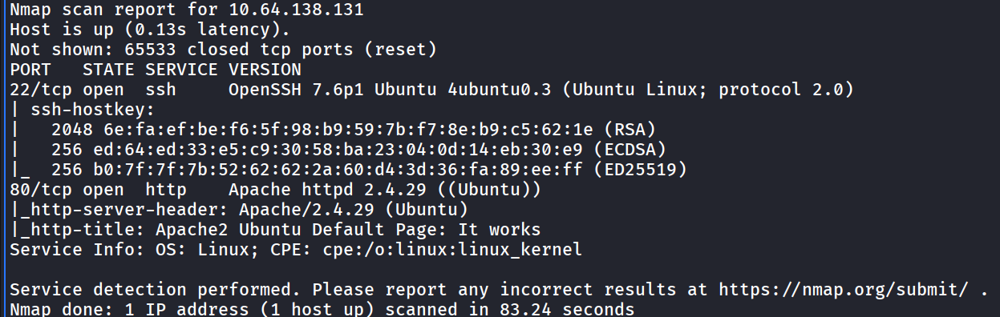

**As we see there is only open 2 Ports open SSH 22 / HTTP 80**

**So for now i will put my focus on the HTTP 80 i opened the the webpage and it seems the default apache documentation.**

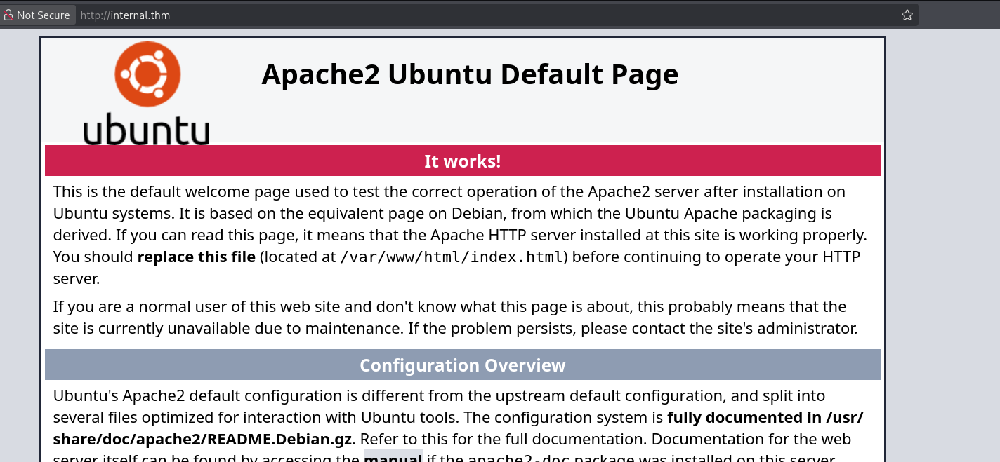

## **Directory Fuzzing**

```php
feroxbuster -u http://internal.thm/ -w /usr/share/wordlists/dirbuster/directory-list-2.3-medium.txt -r -x php,html,txt,js,py,db -t 50 -k
```

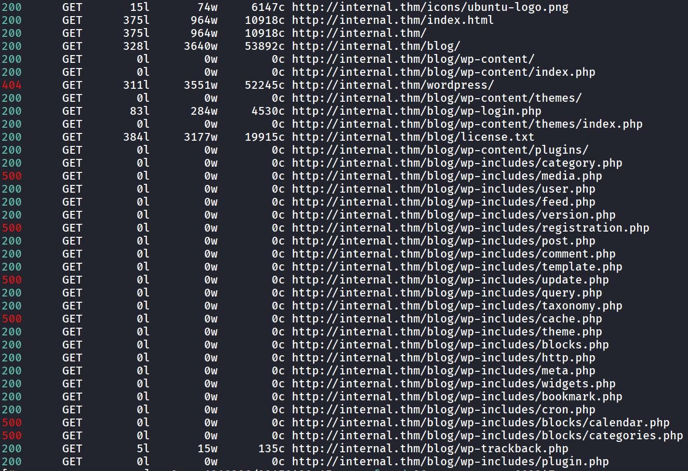

**Once i saw the directory /Blog and i knew its Wordpress i decided to cancel the Fuzzing and go towards it**

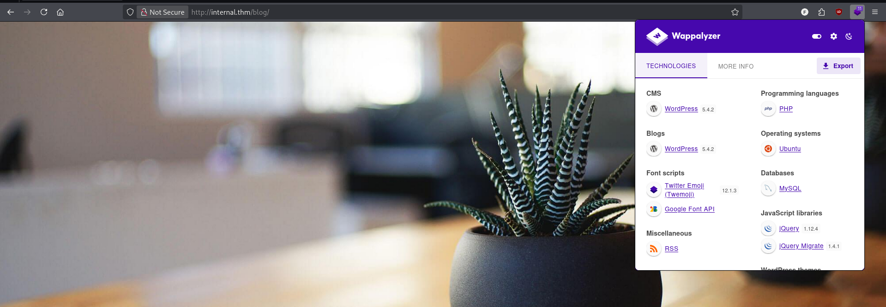

```php
wpscan --url http://internal.thm/blog -e
```

**before the scan finish i tried to access the directories Fuzzed but most of them was useless and blank pages.**

**wpscan didn’t reveal anything interesting but the only thing was the username: admin**

**so i tried to access it with false password to confirm that its exist.**

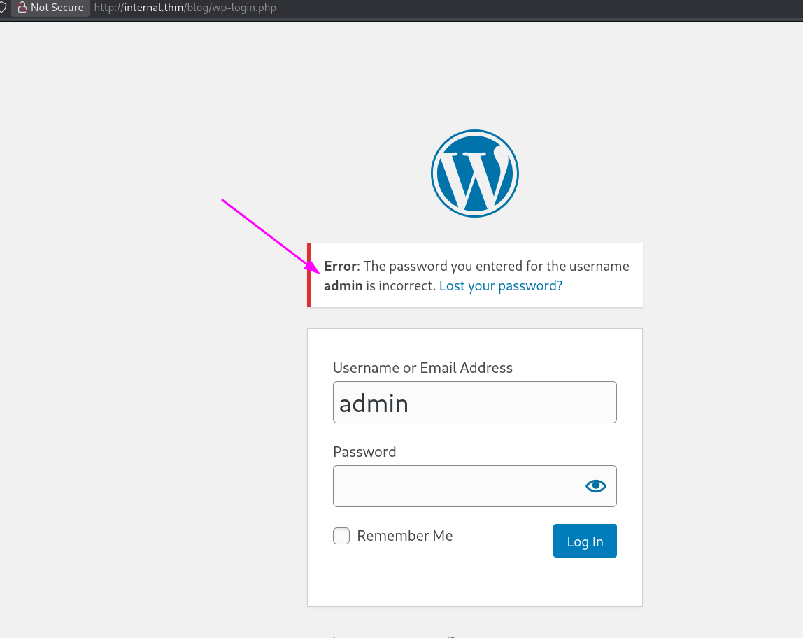

**It exist really cool!!**

# Exploitation

**Now time to brute force so maybe it has weak password.**

```php
wpscan --url http://internal.thm/blog/ -U admin --passwords /usr/share/wordlists/rockyou.txt --password-attack wp-login
```

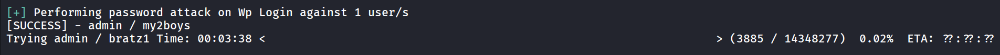

**Boom we got the password!!**

**Lets login with it and upload our reverse shell.**

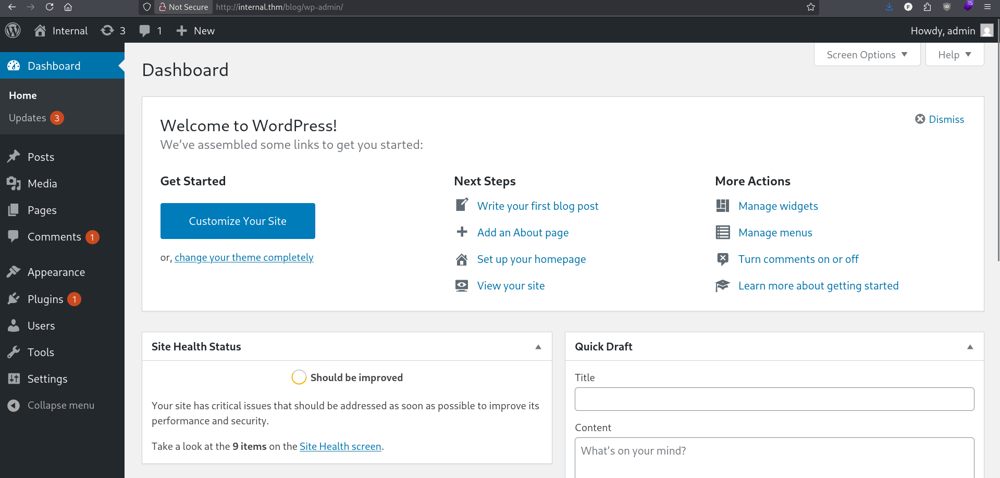

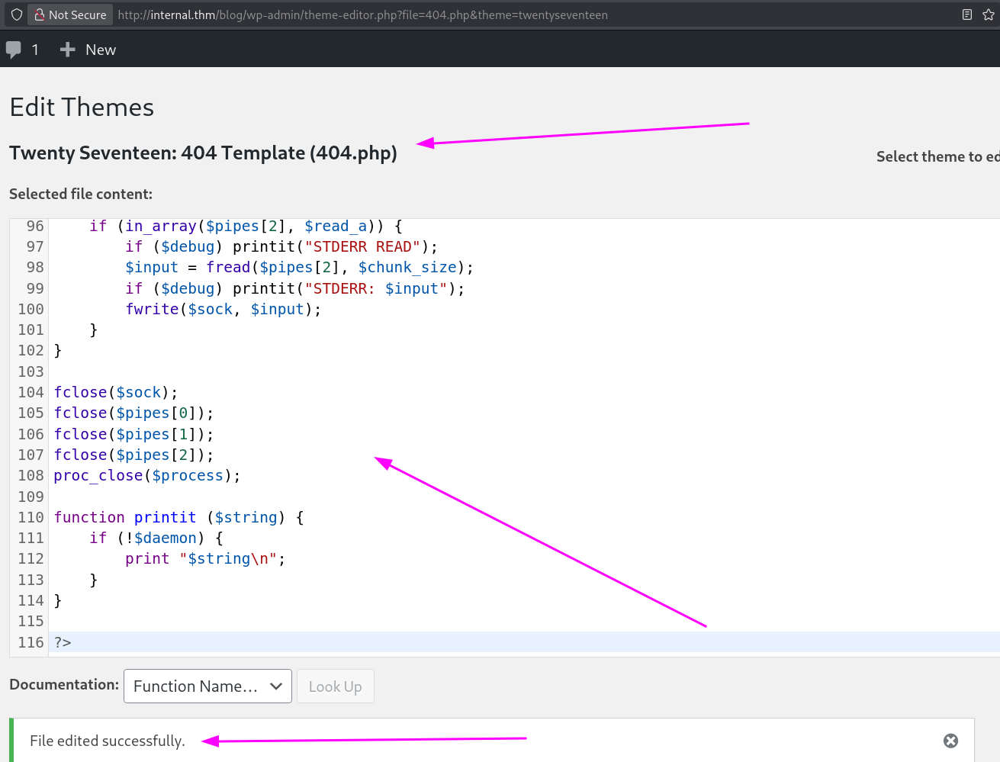

**And start the listener with:**

```php
**nc -lnvp 1234**
```

**Then access it from this path:**

[**http://internal.thm/blog/wp-content/themes/twentyseventeen/404.php**](http://internal.thm/blog/wp-content/themes/twentyseventeen/404.php)

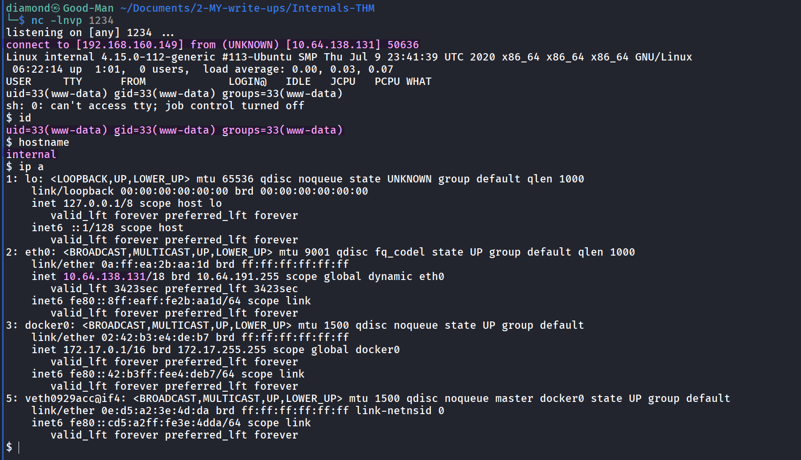

as we see my username is **WWW-DATA** and there is 2 flags i need to secure the first one belongs to a **user** and the other one belongs to the **root** and i have no access to both so i must find a way to escalate my privileges and there is 2 ways to do the process 1 is easy and the other requires much more steps before i knew the harder way i already exploited the easiest way so let me demonstrate it because i didn’t see anyone talking about it.

# Post-Exploitation

## **File transfer**

First thing i want to transfer **Linpeas.sh** to automate the process of the local enumeration.

**Step1:** Host the linpeas with a python http server in your local machine.

**Step2:** Download it from the target machine.

**Step3:** Give it the executable permissions.

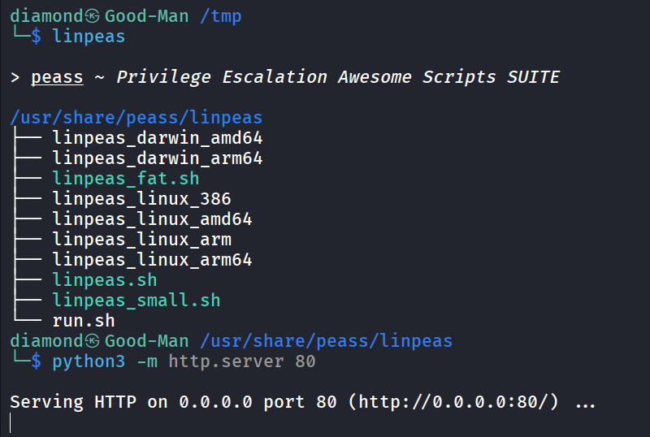

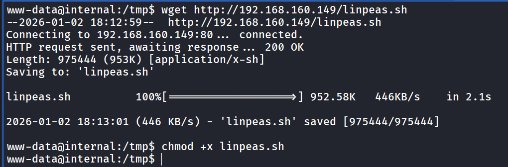

## **Local Enumeration**

Lets run linpeas and see what we can get

Since i am not dealing with this Challenge as a Real Penetration test i followed a methodology that i will look first for outdated versions it might be my PE Vector and first thing i saw is **/usr/bin/pkexec** with **SUID** bit set. And it has a vulnerable version **0.105** that has th**e** famous CVE

**CVE-2021–4034 PwnKit**

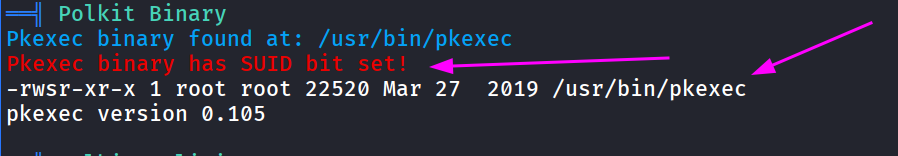

## **Privilege Escalation**

The PoC i used can be accessed from here: [https://github.com/ly4k/PwnKit](https://github.com/ly4k/PwnKit)

**Step1**: Download the Binary [**PwnKit](https://github.com/ly4k/PwnKit)** in your local machine.

**Step2**: Make this file also **PwnKit.sh**

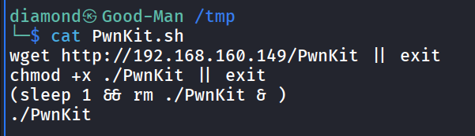

**Step3**: Host these 2 files with python HTTP server.

**Step4**: Download the **PwnKit.sh** to the target machine and give it executable permissions then execute it.

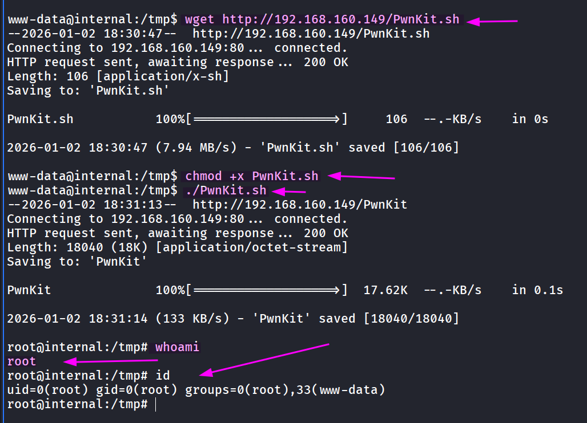

**Boom!!!**

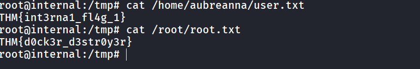

**NOTE: after finishing the root i checked some Write Ups and i found the intended way to solve the challenge was too complex than this way but it was funny xD**
