# Images

# Enumeration

## Nmap

```php
sudo nmap -sS -sV -sC -T4 -n -Pn -p- 10.82.163.1 -oN 'nmap_full'
```

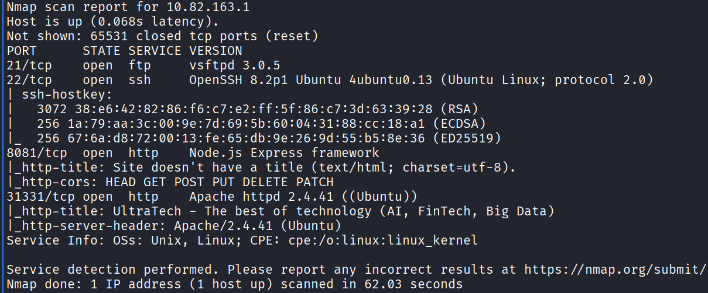

## Port 21 FTP

**There is no anonymous session allowed**

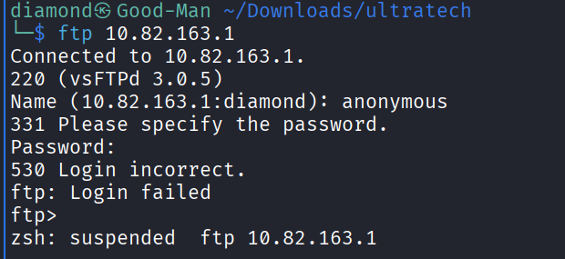

## Port 8081 HTTP

**Let’s Perfrom Directory Fuzzing and Passive enumeration to the page.**

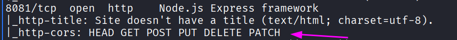

### **Directory Fuzzing**

```php
feroxbuster -u http://10.82.163.1:8081/ -w /usr/share/wordlists/dirbuster/directory-list-2.3-medium.txt -r -x php,asp,aspx,jsp,html,htm,js,txt,bak,old,zip,tar,gz,conf,log,py,db -t 50 -k --output dirs.json
```

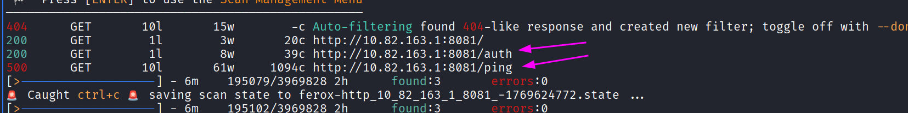

**There 2 Endpoints let’s check them**

### Passive Enumeration

**1- /auth directory seems empty**

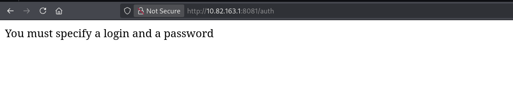

**I Might think about parameter fuzzing but keep it noted for now** 

**2- /Ping endpoint**

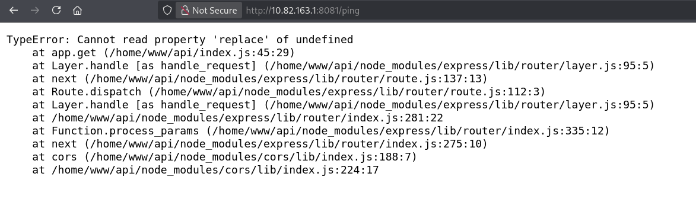

**From This error we know that this ping endpoint takes a parameter and the error reveals that this is node.js**

**When i tried to give it a parameter called `ip` it worked**

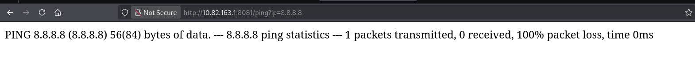

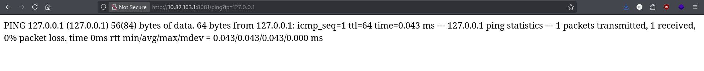

**I Decided to use the burp intruder and try command injection wordlist i have so it maybe works.**

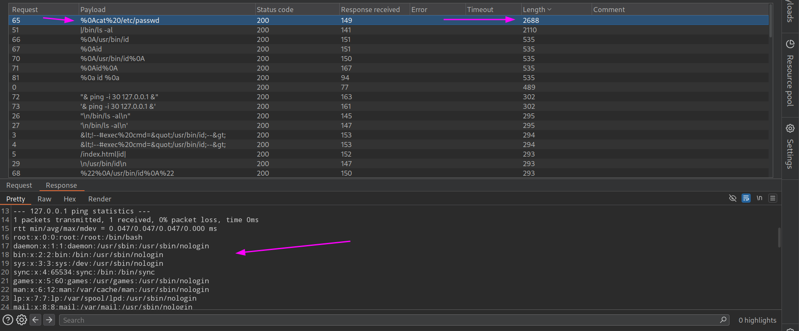

**Good!!! There is a command injection**

## Exploitation / Foot Hold

**Executing `ls` Command Revels utech.db.sqlite file So let’s get it**

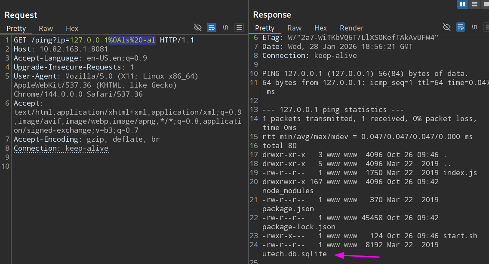

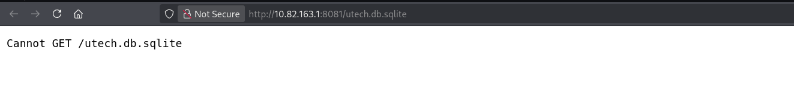

**We can’t get it from here so let’s use command injection to get it** 

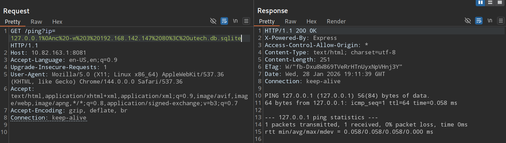

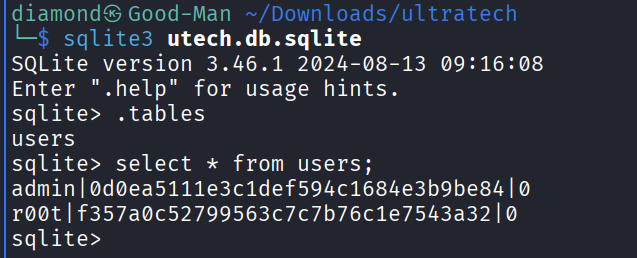

**Nice now we have 2 users and hashes let’s validate which exists**

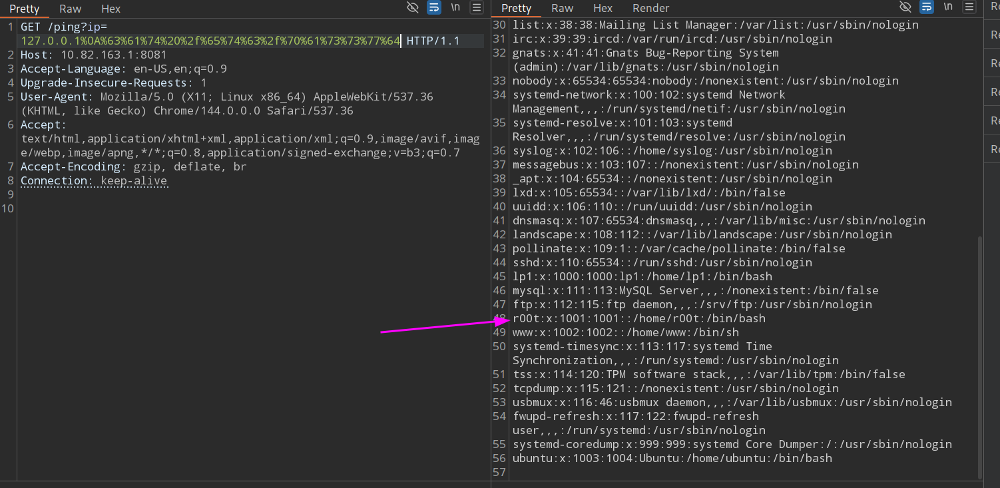

**This fake root it intersting** 

**r00t|f357a0c52799563c7c7b76c1e7543a32|0**

**Let’s Try to crack it**

**Since It’s MD5 hash we can crack it easy using hashcat**

```php
hashcat -m 0 hash.txt /usr/share/wordlists/rockyou.txt
```

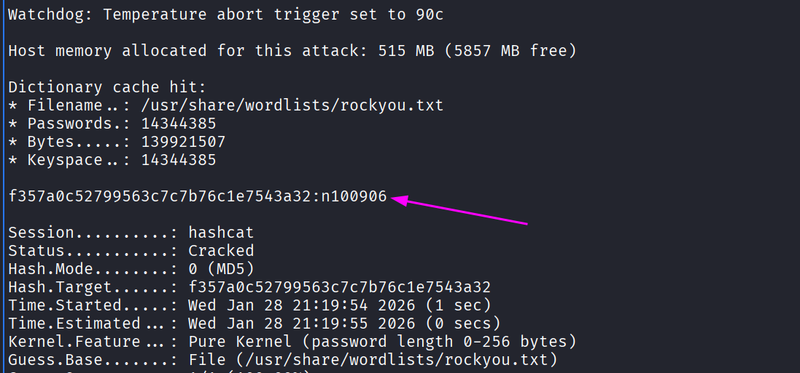

**Nice Now we have valid user and password so let’s Connect to the machine via SSH**

```php
ssh r00t@10.82.163.1 
```

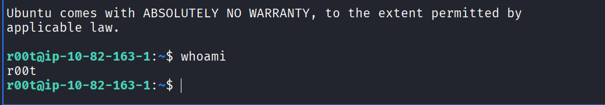

## Privilege Escalation

Command `id` Reveals that i am in a docker group which can be our PE Vector 

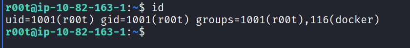

**So let’s validate** 

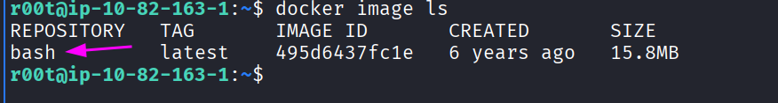

**Nice Let’s Exploit**

```php
docker run -v /:/mnt --rm -it bash chroot /mnt /bin/sh
```

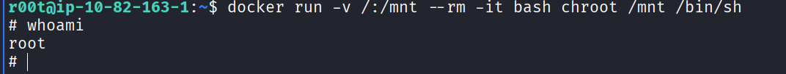